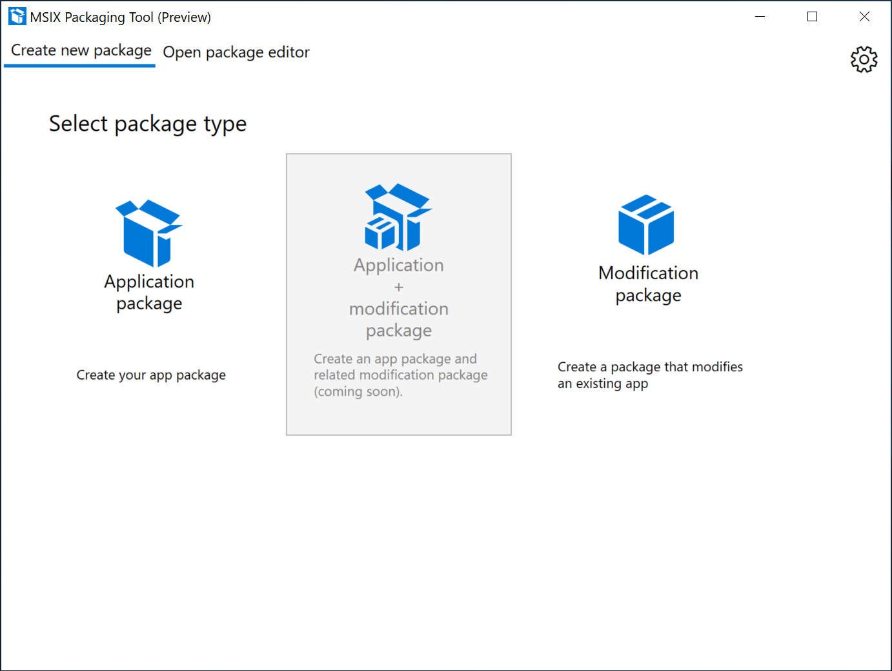
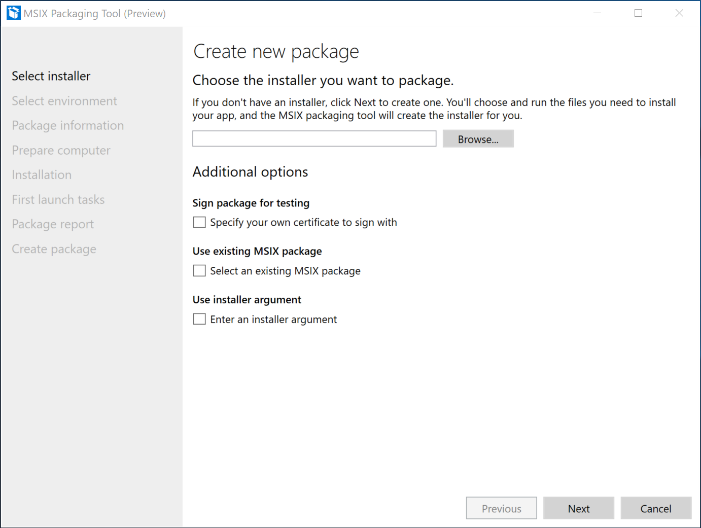
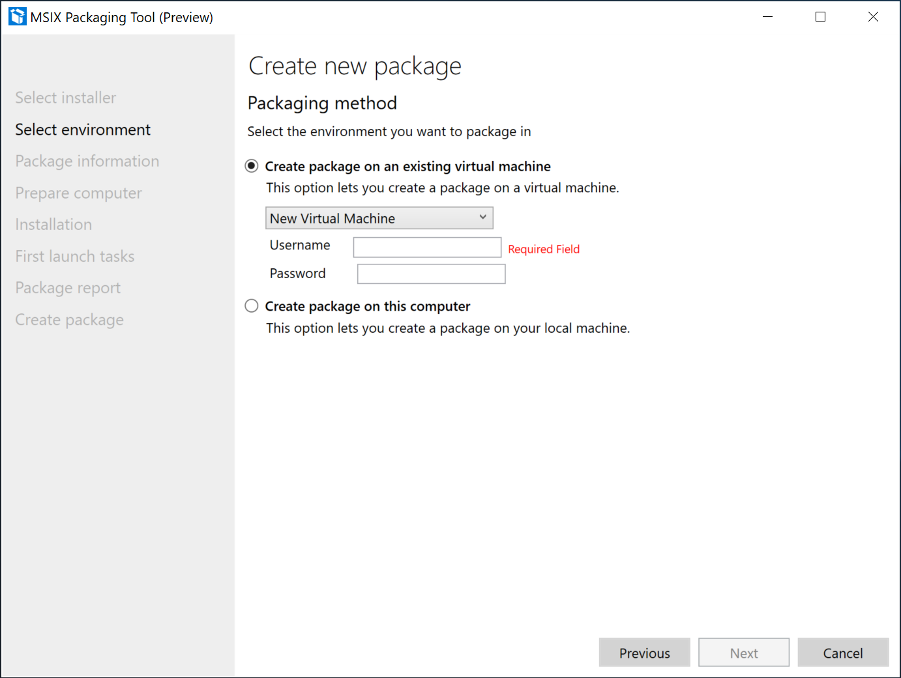
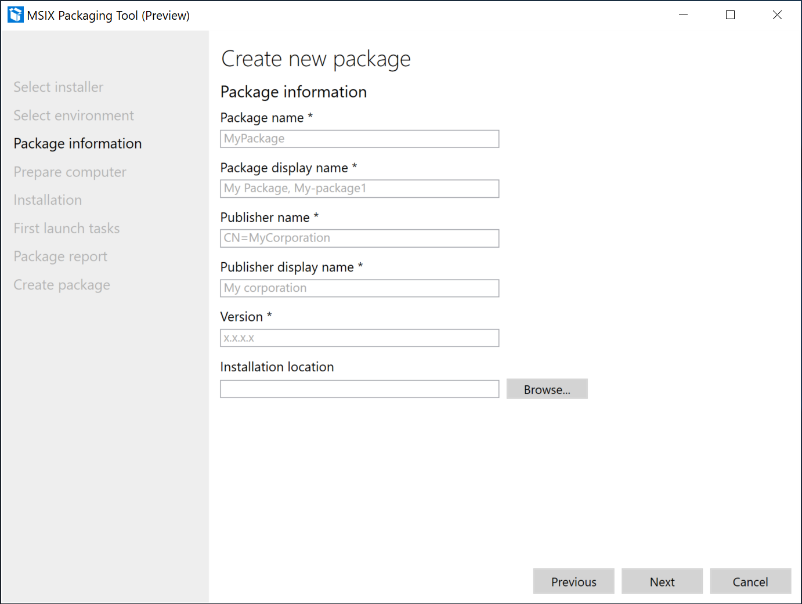
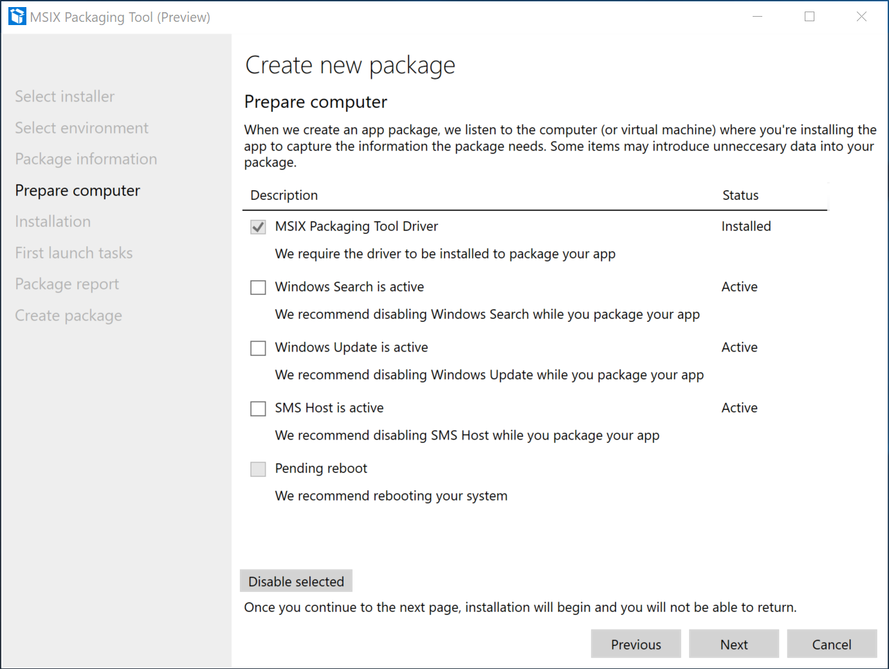
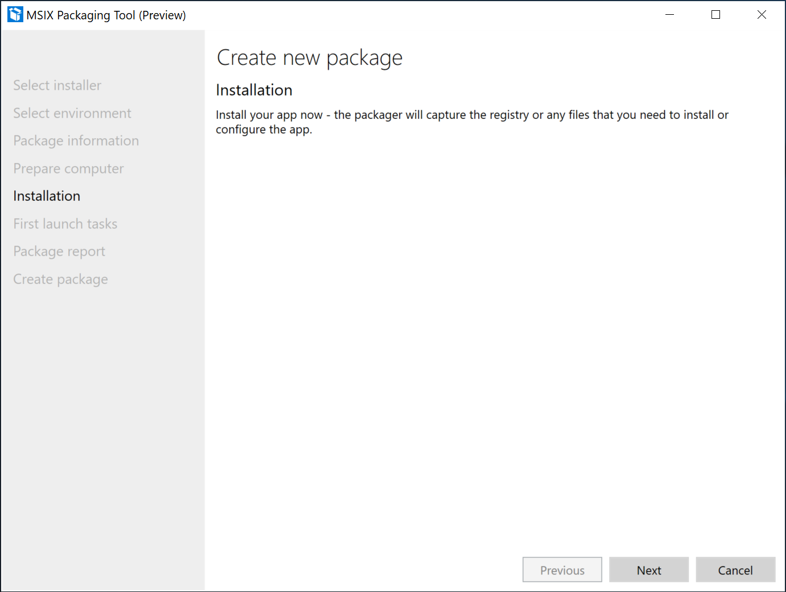
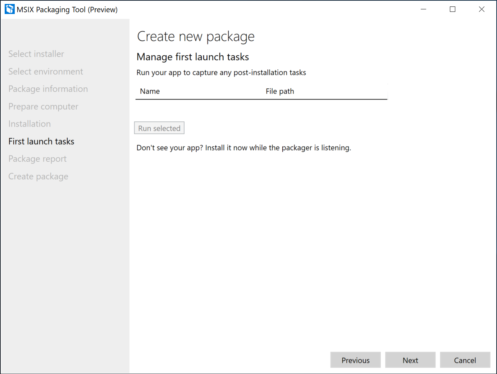
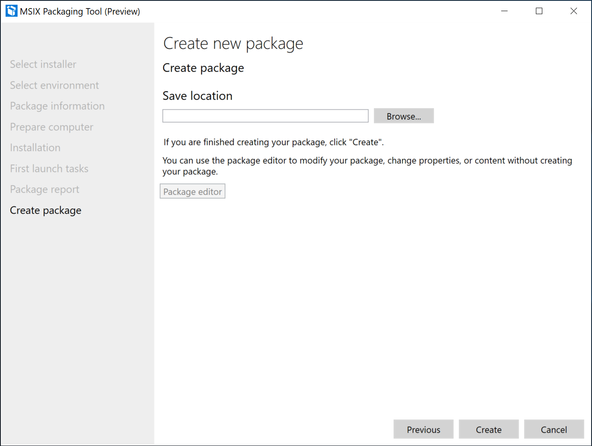

# Creating an application package with MSI on a VM

When the tool is first launched, you will be prompted to provide consent to sending telemetry data. It's important to note that the diagnostic data you share only comes from the app and is never used to identify or contact you. This just helps us fix things faster for you.

Creating an Application package is the most commonly used option. This is where you will create an MSIX package from an installer, or by manual installation of application payload.

Navigate to your MSI installer by hitting Browse and selecting the MSI installer in the filed picker then click Next.

*Optionally*

- Check the box under "Use Existing MSIX Package", browse, and select an existing MSIX package you'd like to update.

- Check the box under "Use installer Preferences" and enter the desired argument in the provided field. This field accepts any string.

- Check the box under sign package for testing, browse to and select your .pfx certificate file. If the certificate is password protected, input it in the password box

**Packaging method**

- Select the Virtual machine for packaging environment

   - "Create package on an existing virtual machine" and from the drop down select an existing Virtual Machine name.

    - You will be presented with user and password fields to provide credentials for the VM if there are any.

    - Click **Next**. 

**Create package on this computer**
 

You've selected to package your application on an existing Virtual machine. Nice job! Provide the information pertaining to the app. The tool will try to auto-fill these fields based on the information available from the installer. You will always have a choice to update the entries as needed. If the field as an asterisk*, it's required, but you already knew that. Inline help is provided if the entry is not valid. 
- Package name:

    - Required and corresponds to package identity Name in the manifest to describe the contents of the package. 

    - Must match the Name subject information of the certificate used to sign a package. 

    - Is not shown to the end user. 
    - Is case-sensitive and cannot have a space. 
    - Can accept string between 3 and 50 characters in length that consists of alpha-numeric, period, and dash characters. 
    - Cannot end with a period and be one of these: "CON", "PRN", "AUX", "NUL", "COM1", "COM2", "COM3", "COM4", "COM5", "COM6", "COM7", "COM8", "COM9", "LPT1", "LPT2", "LPT3", "LPT4", "LPT5", "LPT6", "LPT7", "LPT8", and "LPT9." 
- Package display name:
    - Required and corresponds to package in the manifest to display a friendly package name to the user, in start menu and settings pages.
    - Field accepts A string between 1 and 256 characters in length and is localizable.
- Publisher name
    - Required and corresponds to package that describes the publisher information. 
    - The Publisher attribute must match the publisher subject information of the certificate used to sign a package. 
    - This field accepts a string between 1 and 8192 characters in length that fits the regular expression of a distinguished name : "(CN | L | O | OU | E | C | S | STREET | T | G | I | SN | DC | SERIALNUMBER | Description | PostalCode | POBox | Phone | X21Address | dnQualifier | (OID.(0 | [1-9][0-9])(.(0 | [1-9][0-9]))+))=(([^,+="<>#;])+ | ".")(, ((CN | L | O | OU | E | C | S | STREET | T | G | I | SN | DC | SERIALNUMBER | Description | PostalCode | POBox | Phone | X21Address | dnQualifier | (OID.(0 | [1-9][0-9])(.(0 | [1-9][0-9]))+))=(([^,+="<>#;])+ | ".")))*".
- Publisher display name

    - Required and corresponds to package in the manifest to display a friendly publisher name to the user, in App installer and settings pages.
    - Field accepts A string between 1 and 256 characters in length and is localizable. 
- Version
    - Required and corresponds to package in the manifest to describe the The version number of the package. 
    - This field accepts a version string in quad notation, "Major.Minor.Build.Revision". 
- Install location
    - This is the location that the installer is going to copy the application payload to (usually Programs Files folder). 
    - This field is optional but recommended. 
    - Browse to and select a folder path. 
    - Make sure this filed matches Installers Install location while you go through the application install operation.

**Prepare computer**

- You are provided with options to prepare the computer for packaging. 
- MSIX Packaging Tool Driver is required and the tool will automatically try to enable it if it is not enabled. 
    - The tool will first check with DISM to see if the driver is installed. 
> [!NOTE] > MSIX Packaging tool driver monitors the system to capture the changes that an installer is making on the system which allows MSIX Packaging Tool to create a package based on those changes.

- [Optional] Check the box for “Windows Search is Active” and select “disable selected” if you choose to disable the search service. 
    - This is not required, only recommended. 
    - Once disabled, the tool will update the status field to “disabled” 

- [Optional] Check the box for “Windows Update is Active” and select “disable selected” if you choose to disable the Update service. 
    - This is not required, only recommended. 
    - Once disabled, the tool will update the status field to “disabled” 

- “Pending reboot” checkbox is disabled by default. You'll need to manually restart the machine and then launch the tool again if you are prompted that pending operations need a reboot. 
    - This not required, only recommended. When you're done preparing the machine, click **Next**. 

**Installation**

- This is installation phase where the tool is monitoring and capturing the application install operations. 
- The tool will launch the installer in the Virtual Machine Window that it opened in an earlier stage and you'll need to go through the installer wizard to install the application. 
    - Make sure the installation path matches what was defined earlier in the package information page. 
    - You'll need to create a shortcut in desktop for the newly installed application. 
    - Once you're done with the application installation wizard, make sure you finish or close on the installation wizard. 
    - If you need to run multiple installers you can do that manually at this point. 
    - If the app needs other pre-reqs, you need to install them now. 
    - If the application needs .Net 3.5/20, add the optional feature to Windows. 
- When you've completed installing the application, click **Next**. 

**Manage first launch tasks**

- This page shows application executables that the tool captured. 
- We recommended launching the application at least once to capture any first launch tasks. 
- If there are multiple applications, check the box that corresponds to the main entry point. 
- If you don't see the application .exe here, manually browse to and run it. 
- Click **Next** 

You'll be prompted with a pop up asking for confirmation that you're finished with application installation and managing first launch tasks. 
- If you're done, click **Yes, move on**. 
- If you're not done, click **No, I'm not done**. You'll be taken back to the last page to where you can launch applications, install or copy other files, and dlls/executables. 

**Create package**
 

- Provide a location to save the MSIX package.
- By default, packages are saved in local app data folder.
- You can define the default save location in Settings menu.
- If you'd like to continue to edit the content and properties of the package before saving the MSIX package, you can select “Package editor” and be taken to package editor. 
- If you prefer to sign the package with a pre-made certificate for testing, browse to and select the certificate. 
- Click **Create** to create the MSIX package. 

You'll be presented with the pop up when the package is created. This pop up will include the name, publisher, and save location of the newly created package. You can close this pop up and get redirected to the welcome page. You can also select package editor to see and modify the package content and properties. 
