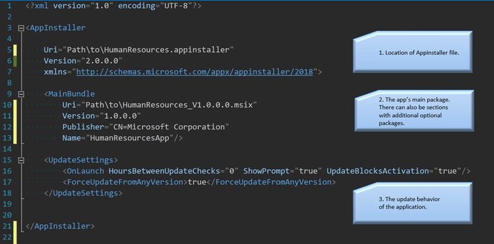

# App Installer file overview

Often, you need to share your app with many users. Later you need to update the app and you want to make sure you can do that in a way that is seamless even for your non-technical users, and easy for you.

To help you achieve this, we introduced the App Installer file. This is an XML file that you can create yourself or create using Visual Studio (see Visual Studio instructions [here](create-appinstallerfile-vs.md)). The App Installer file specifies where your app is located and how to update it. If you choose to use this method of app distribution, you must share with your users the App Installer file, instead of the actual app container. The user must then click on the App Installer file. At this point the familiar App Installer UI will appear and guide the user through the installation.  Once the user has installed the application using these steps, the application is associated with the App Installer file.  

Later, when you have an update to the application, you only update the App Installer (.appinstaller) file. When you update the file, the new version of the application is pushed to the user. This is especially good for your users because they don’t have to do anything to get the update. They just keep using the application as usual, and the update will be delivered to them.

Here's an example showing how this works:

1. IT Pro Joe wants to distribute the Human Resources app to his enterprise.
2. IT Pro Joe puts the Human Resources app on a share and creates an App Installer file named HumanResources.appinstaller. This App Installer file is associated with the app.
3. IT Pro Joe puts HumanResources.appinstaller on a share.
4. IT Pro Joe points the enterprise’s employees to HumanResources.appinstaller.
5. Manager Maggie clicks on HumanResources.appinstaller and gets the App Installer UI, which guides her to install the Human Resources application.
6. From that point, on manager Maggie’s device Human Resources is just another app and she interacts with it as she does with any other app. She can pin it to the task bar or the start menu, it appears in her apps list etc.
7. A week later IT pro Joe gets an update to the Human Resources app. To share it with users, he just updates HumanResources.appinstaller to point to the new app version and sets the update type he wants.
8. The next morning, Manager Maggie, who doesn’t know anything about the update launches the Human Resources application that’s already on her desktop.
9. The application detects that there’s an update and applies the update automatically
10. Manager Maggie is happy that she now has the latest version of the application and can take advantage of the new features.

Starting in the Windows 10 Fall Creators Update (version 1709, build 16299) and later releases, the Windows SDK also provides several APIs that you can use to programmatically modify packages via App Installer files or to retrieve information about apps with an App Installer association. For more information, see [Related documentation](app-installer-documentation.md).

## Contents of the App Installer file

The following image shows an example App Installer file. For full details about the XML elements in the App Installer file, see the [App Installer file schema reference](https://docs.microsoft.com/uwp/schemas/appinstallerschema/schema-root). For more information about how to configure update settings in the App Installer file, see [Configure update settings in the App Installer file](update-settings.md).

## Related topics

* [Create an App Installer file with Visual Studio](create-appinstallerfile-vs.md)
* [Create an App Installer file manually](how-to-create-appinstaller-file.md)
* [Configure update settings in the App Installer file](update-settings.md)
