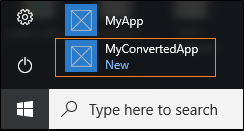

# Run, debug, and test a packaged desktop application

Run your packaged application and see how it looks without having to sign it. Then, set breakpoints and step through code. When you're ready to test your application in a production environment, sign your application and then install it. This topic shows you how to do each of these things.

<a id="run-app" />

## Run your application

You can run your application to test it out locally without having to obtain a certificate and sign it. How you run the application depends on what tool you used to create the package.

### You created the package by using Visual Studio

Set the packaging project as the startup project, and then press CTRL+F5 to start your app.

### You created the package manually or by using the Desktop App Converter

Open a Windows PowerShell command prompt, and from the **PackageFiles** subfolder of your output folder, run this cmdlet:

```
Add-AppxPackage –Register AppxManifest.xml
```
To start your app, find it in the Windows Start menu.



> [!NOTE]
> A packaged application always runs as an interactive user, and any drive that you install your packaged application on to must be formatted to NTFS format.

## Debug your app

How you debug the application depends on what tool you used to create the package.

If you created your package by using the [new packaging project](desktop-to-uwp-packaging-dot-net.md#new-packaging-project) available in the 15.4 release of Visual Studio 2017, Just set the packaging project as the startup project, and then press F5 to debug your app.

If you created your package by using any other tool, follow these steps.

1. Make sure that you start your packaged application at least one time so that it's installed on your local machine.

   See the [Run your app](#run-app) section above.

2. Start Visual Studio.

   If you want to debug your application with elevated permissions, start Visual Studio by using the **Run as Administrator** option.

3. In Visual Studio, choose **Debug**->**Other Debug Targets**->**Debug Installed App Package**.

4. In the **Installed App Packages** list, select your app package, and then choose the **Attach** button.

#### Modify your application in between debug sessions

If you make your changes to your application to fix bugs, repackage it by using the MakeAppx tool. See [Run the MakeAppx tool](desktop-to-uwp-manual-conversion.md#make-appx).

### Debug the entire application lifecycle

In some cases, you might want finer-grained control over the debugging process, including the ability to debug your application before it starts.

You can use [PLMDebug](https://msdn.microsoft.com/library/windows/hardware/jj680085(v=vs.85).aspx) to get full control over application lifecycle including suspending, resuming, and termination.

[PLMDebug](https://msdn.microsoft.com/library/windows/hardware/jj680085(v=vs.85).aspx) is included with the Windows SDK.

## Test your app

To test your application in a realistic setting as you prepare for distribution, it's best to sign your application and then install it.

### Test an application that you packaged by using Visual Studio

Visual Studio signs your application by using a test certificate. You'll find that certificate in the output folder that the **Create App Packages** wizard generates. The certificate file has the *.cer* extension and you'll have to install that certificate into the **Trusted Root Certification Authorities** store on the PC that you want to test your application on. See [Sideload your package](../package/packaging-uwp-apps.md#sideload-your-app-package).

### Test an application that you packaged by using the Desktop App Converter (DAC)

If you package your application by using the Desktop App Converter, you can use the ``sign`` parameter to automatically sign your application by using a generated certificate. You'll have to install that certificate, and then install the app. See [Run the packaged app](desktop-to-uwp-run-desktop-app-converter.md#run-app).


### Manually sign apps (Optional)

You can also sign your application manually. Here's how

1. Create a certificate. See [Create a certificate](../package/create-certificate-package-signing.md).

2. Install that certificate into the **Trusted Root** or **Trusted People** certificate store on your system.

3. Sign your application by using that certificate, see [Sign an app package using SignTool](../package/sign-app-package-using-signtool.md).

  > [!IMPORTANT]
  > Make sure that the publisher name on your certificate matches the publisher name of your app.

**Related sample**

[SigningCerts](https://github.com/Microsoft/DesktopBridgeToUWP-Samples/tree/master/Samples/SigningCerts)


### Test your application for Windows 10 S

Before you publish your app, make sure that it will operate correctly on devices that run Windows 10 S. In fact, if you plan to publish your application to the Microsoft Store, you must do this because it is a store requirement. Apps that don't operate correctly on devices that run Windows 10 S won't be certified.

See [Test your Windows application for Windows 10 S](desktop-to-uwp-test-windows-s.md).

### Run another process inside the full trust container

You can invoke custom processes inside the container of a specified app package. This can be useful for testing scenarios (for example, if you have a custom test harness and want to test output of the app). To do so, use the ```Invoke-CommandInDesktopPackage``` PowerShell cmdlet:

```CMD
Invoke-CommandInDesktopPackage [-PackageFamilyName] <string> [-AppId] <string> [-Command] <string> [[-Args]
    <string>]  [<CommonParameters>]
```

## Next steps

**Find answers to your questions**

Have questions? Ask us on Stack Overflow. Our team monitors these [tags](https://stackoverflow.com/questions/tagged/project-centennial+or+desktop-bridge). You can also ask us [here](https://social.msdn.microsoft.com/Forums/en-US/home?filter=alltypes&sort=relevancedesc&searchTerm=%5BDesktop%20Converter%5D).

**Give feedback or make feature suggestions**

See [UserVoice](https://wpdev.uservoice.com/forums/110705-universal-windows-platform/category/161895-desktop-bridge-centennial).
