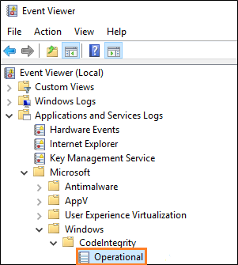
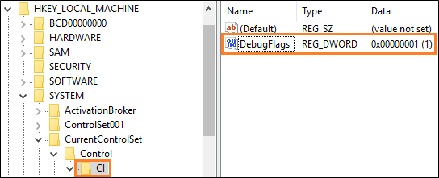

# Test your Windows app for Windows 10 in S mode

You can test your Windows app to ensure that it will operate correctly on devices that run Windows 10 in S mode. In fact, if you plan to publish your app to the Microsoft Store, you must do this because it is a store requirement. To test your app, you can apply a Device Guard Code Integrity policy on a device that is running Windows 10 Pro.

> [!NOTE]
> The device on which you apply the Device Guard Code Integrity policy must be running Windows 10 Creators Edition (10.0; Build 15063) or later.

The Device Guard Code Integrity policy enforces the rules that apps must conform to in order to run on Windows 10 S.

> [!IMPORTANT]
>We recommend that you apply these policies to a virtual machine, but if you want to apply them to your local machine, make sure to review our best practice guidance in the "Next, install the policy and restart your system" section of this topic before you apply a policy.

<a id="choose-policy" />

## First, download the policies and then choose one

Download the Device Guard Code Integrity policies [here](https://go.microsoft.com/fwlink/?linkid=849018).

Then, choose the one that makes the most sense to you. Here's summary of each policy.

|Policy |Enforcement |Signing certificate |File name |
|--|--|--|--|
|Audit mode policy |Logs issues / does not block |Store |SiPolicy_Audit.p7b |
|Production mode policy |Yes |Store |SiPolicy_Enforced.p7b |
|Product mode policy with self-signed apps |Yes |AppX Test Cert  |SiPolicy_DevModeEx_Enforced.p7b |

We recommend that you start with audit mode policy. You can review the Code Integrity Event Logs and use that information to help you make adjustments to your app. Then, apply the Production mode policy when you're ready for final testing.

Here’s a bit more information about each policy.

### Audit mode policy
With this mode, your app runs even if it performs tasks that aren’t supported on Windows 10 S. Windows logs any executables that would have been blocked into the Code Integrity Event Logs.

You can find those logs by opening the **Event Viewer**, and then browsing to this location: Application and Services Logs->Microsoft->Windows->CodeIntegrity->Operational.

This mode is safe and it won't prevent your system from starting.

#### (Optional) Find specific failure points in the call stack
To find specific points in the call stack where blocking issues occur, add this registry key, and then [set up a kernel-mode debugging environment](https://docs.microsoft.com/windows-hardware/drivers/debugger/getting-started-with-windbg--kernel-mode-#span-idsetupakernel-modedebuggingspanspan-idsetupakernel-modedebuggingspanspan-idsetupakernel-modedebuggingspanset-up-a-kernel-mode-debugging).

|Key|Name|Type|Value|
|--|---|--|--|
|HKEY_LOCAL_MACHINE\SYSTEM\CurentControlSet\Control\CI| DebugFlags |REG_DWORD | 1 |

### Production mode policy
This policy enforces code integrity rules that match Windows 10 S so that you can simulate running on Windows 10 S. This is the strictest policy, and it is great for final production testing. In this mode, your app is subject to the same restrictions as it would be subject to on a user's device. To use this mode, your app must be signed by the Microsoft Store.

### Production mode policy with self-signed apps
This mode is similar to the Production mode policy, but it also allows things to run that are signed with the test certificate that is included in the zip file. Install the PFX file that is included in the **AppxTestRootAgency** folder of this zip file. Then, sign your app with it. That way, you can quickly iterate without requiring Store signing.

Because the publisher name of your certificate must match the publisher name of your app, you'll have to temporarily change the value of the **Identity** element's **Publisher** attribute to "CN=Appx Test Root Agency Ex". You can change that attribute back to it's original value after you've completed your tests.

## Next, install the policy and restart your system

We recommend that you apply these policies to a virtual machine because these policies might lead to boot failures. That's because these policies block the execution of code that isn't signed by the Microsoft Store, including drivers.

If you want to apply these policies to your local machine, it's best to start with the Audit mode policy. With this policy, you can review the Code Integrity Event Logs to ensure that nothing critical would be blocked in an enforced policy.

When you're ready to apply a policy, find the .P7B file for the policy that you chose, rename it to **SIPolicy.P7B**, and then save that file to this location on your system: **C:\Windows\System32\CodeIntegrity\\**.

Then, restart your system.

>[!NOTE]
>To remove a policy from your system, delete the .P7B file and then restart your system.

## Next steps

**Find answers to your questions**

Have questions? Ask us on Stack Overflow. Our team monitors these [tags](https://stackoverflow.com/questions/tagged/project-centennial+or+desktop-bridge). You can also ask us [here](https://social.msdn.microsoft.com/Forums/en-US/home?filter=alltypes&sort=relevancedesc&searchTerm=%5BDesktop%20Converter%5D).

**Give feedback or make feature suggestions**

See [UserVoice](https://wpdev.uservoice.com/forums/110705-universal-windows-platform/category/161895-desktop-bridge-centennial).

**Review a detailed blog article that was posted by our App Consult Team**

See [Porting and testing your classic desktop applications on Windows 10 S with the Desktop Bridge](https://blogs.msdn.microsoft.com/appconsult/2017/06/15/porting-and-testing-your-classic-desktop-applications-on-windows-10-s-with-the-desktop-bridge/).

**Learn about tools that make it easier to test for Windows in S Mode**

See [Unpackage, modify, repackage, sign an APPX](https://blogs.msdn.microsoft.com/appconsult/2017/08/07/unpack-modify-repack-sign-appx/).
