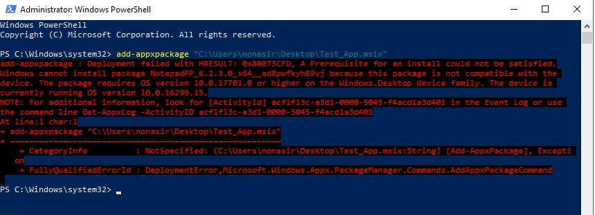
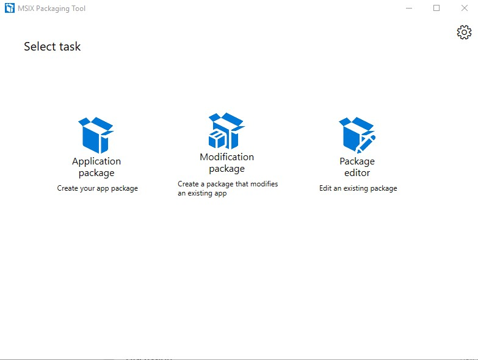
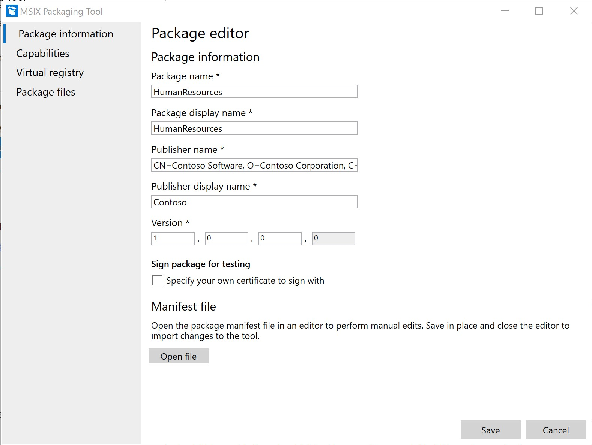
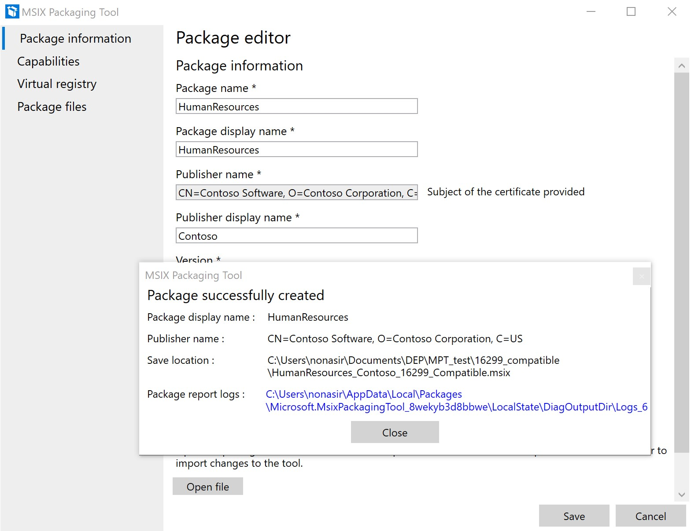

# MSIX package support on Windows 10 version 1709 and later

If you've converted an existing app to MSIX, you may want to use the app in versions of the OS before Windows 10, version 1809 (build 17763). This article discusses how to support your MSIX package in Windows 10 version 1709 (build 16299) and later.

## Problem

So you converted your existing app to MSIX using the MSIX Packaging Tool and it runs fine on Windows 10, version 1809 and later. But now that you know we are adding support for MSIX starting build Windows 10 version 1709, you want to run your MSIX app on this or any later version of Windows 10. Currently, if you just try to install your MSIX package on a computer with Windows 10 version 1709 or Windows 10 version 1803, you'll get this error message:



## Solution

We are working to update the MSIX Packaging Tool to handle this, but in the meantime here's what you can to do to set up your app to run on these builds.

1. Open the MSIX Packaging Tool and click **Package editor**.
  

2. Browse to your MSIX package and click **Open package**.
  

3. On the bottom of the **Package Information** tab, under **Manifest file**, click **Open file**.
  

4. In the manifest file, edit the **MinVersion** to equal 16299 as shown below.
  

5. After you are done editing the manifest, close the file. This will return you to the **Package editor**. Don't forget to re-sign the edited package as shown below:
  

6. After you have completed the updates, save your changes.
  

At this point, you can install the app on a computer running Windows 10, version 1709 or later.

## Troubleshooting tips

For now, on computers running Windows 10, version 1709 (build 16299) to build 17700, you can install MSIX apps through PowerShell.
Specifically, you need this command in PowerShell:

```powershell
add-appxpackage <path to MSIX package>
```


You can also use Intune, SCCM or the Packaging Manager API.