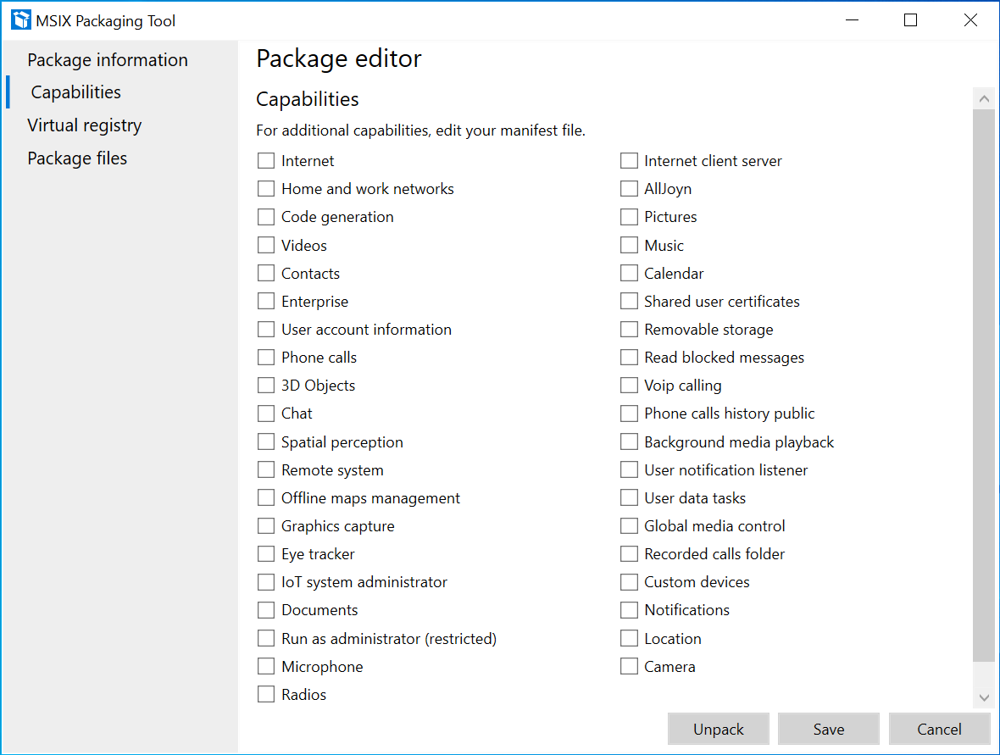
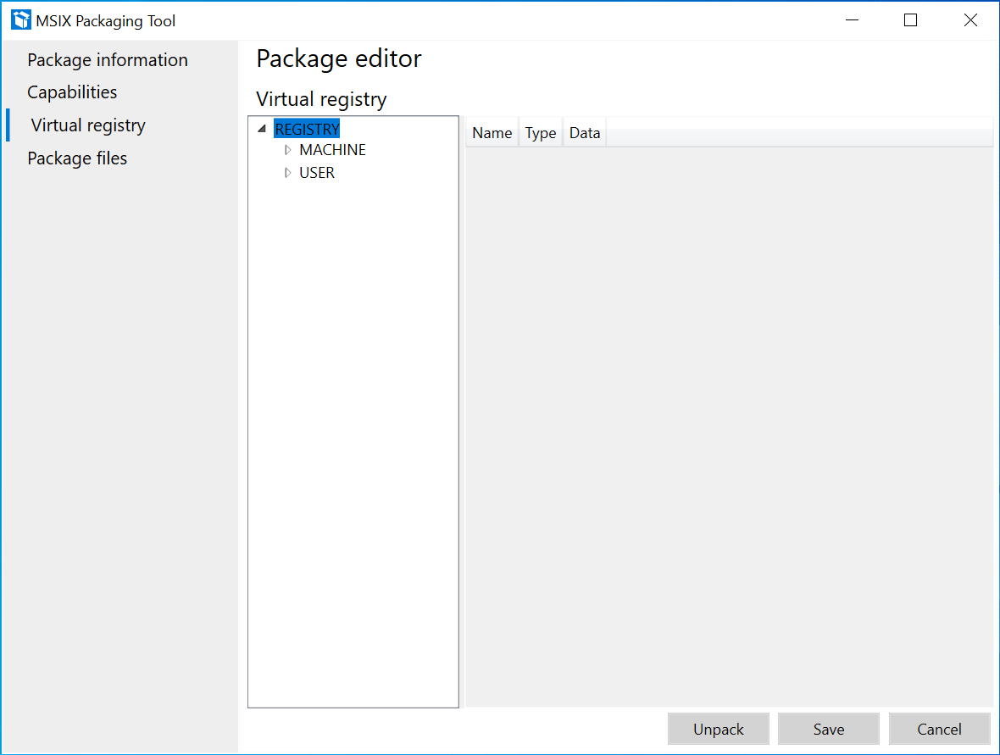
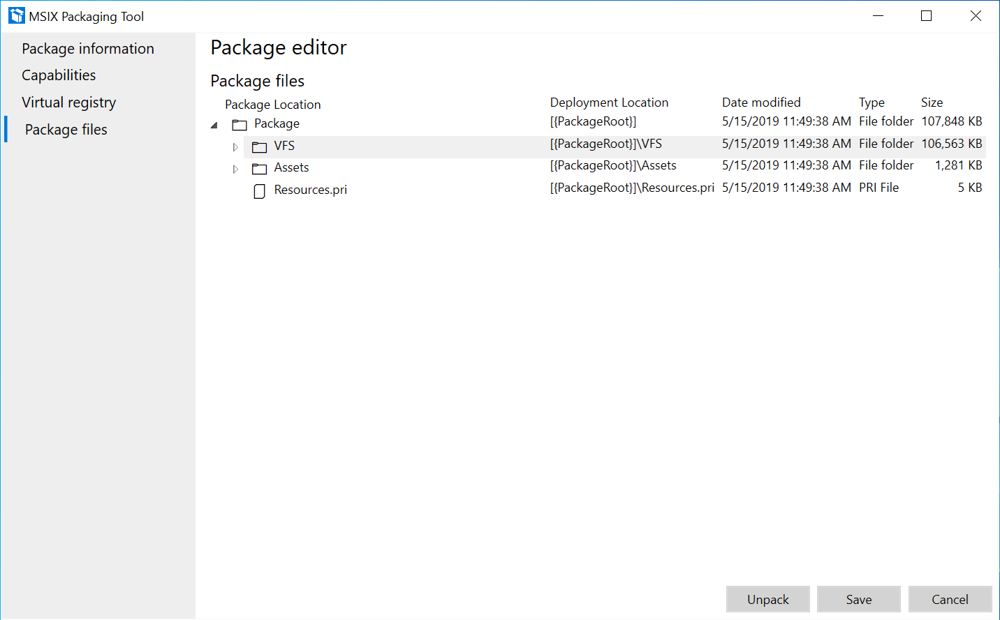

# Edit a package using Package editor

<a class="x-hidden-focus" href="https://www.microsoft.com/en-us/p/msix-packaging-tool/9n5lw3jbcxkf" data-linktype="external">Get MSIX Packaging Tool</a>

To make changes to an existing MSIX package, such as editing the properties in the manifest or the contents of the package without having to package the installer again, you can use **Package editor** in the MSIX Packaging Tool.

From the welcome page of the MSIX Packaging Tool, select the **Package editor** icon, browse for your MSIX package and select **Open package**. You can also right-click on an MSIX package, and select **Edit with MSIX Packaging Tool** (Available on versions 1.2019.1018.0 and later).

You can unpack your MSIX package from the package editor through the 'unpack' button on the bottom. You can then select the location where you would like to unpack your MSIX package. 

## Package information page

On the **Package information** page, you can change your package information through the fields in the UI or choose to open the MSIX manifest file manually in the editor of your choice to make changes to the manifest fields. While you are editing the manifest the package editor page is not editable. Once you save the manifest, the UI will get updated.

You can navigate to other sections of the package editor to edit your capabilities, virtual registry, or package files. When you are finished editing your package, be sure to sign your package and update your version before saving your changes.

## Capabilities page

On the **Capabilities** page you can add or remove [capabilities](https://docs.microsoft.com/uwp/schemas/appxpackage/uapmanifestschema/element-capability) for the package. If a capability is present in the package, then the checkbox will be checked. If you select or deselect a capability, it will update your manifest. This translates to the <capability> element in the MSIX manifest.

## Virtual registry page

The **Virtual registry** page shows all the packaged virtual registry entries for the application.

Right-click a node in left window to perform the these operations:

- Expand/collapse: to expand or collapse all the registry keys in the hive.
- Key: allows user to rename, delete or create a new key.
- Value: allows user to add a key value as string, binary or DWORD.

Right-click anywhere in the right window to perform the these operations:

- Delete: to delete a key.
- Add String: to add a string value to a key.
- Add binary: to add a binary value to a key.
- Add DWORD: to add a DWORD value to a key.

## Package files page

On the **Package files** page, you can double click to expand the file system of the package contents. For example, you can use this page to [edit app icons and assets](edit-icons-and-assets.md).

Right-click a folder to perform the these operations:

- Add file: Add a file to the folder selected.
- New folder: Create a new empty folder.
- Add folder: Browse to add an existing folder.
- Delete: Delete the selected folder.
- Move: Rename or move the folder to a new location.

Right-click on a file to perform the these operations:

- Delete: Delete the selected file.
- Move: Rename or move the file to a new location.

