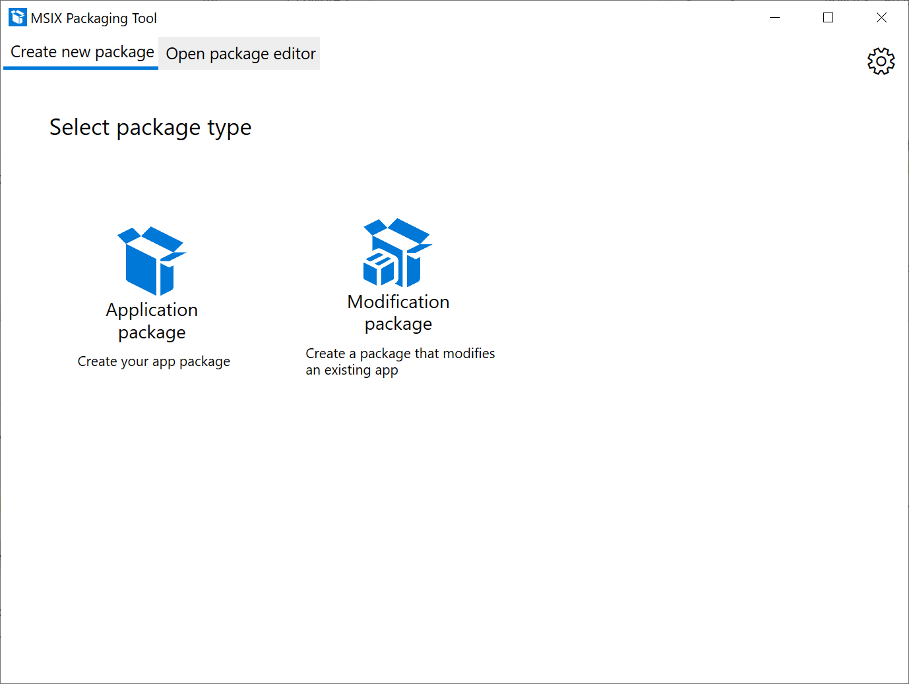
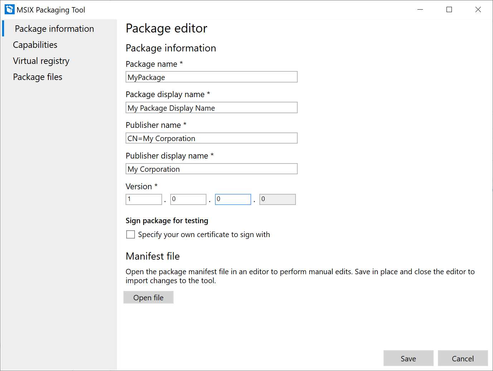
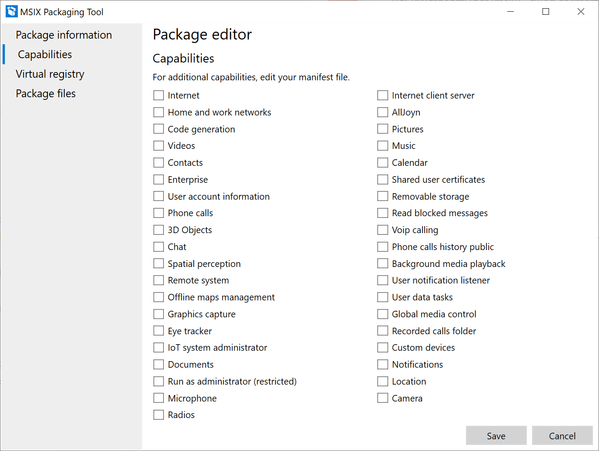
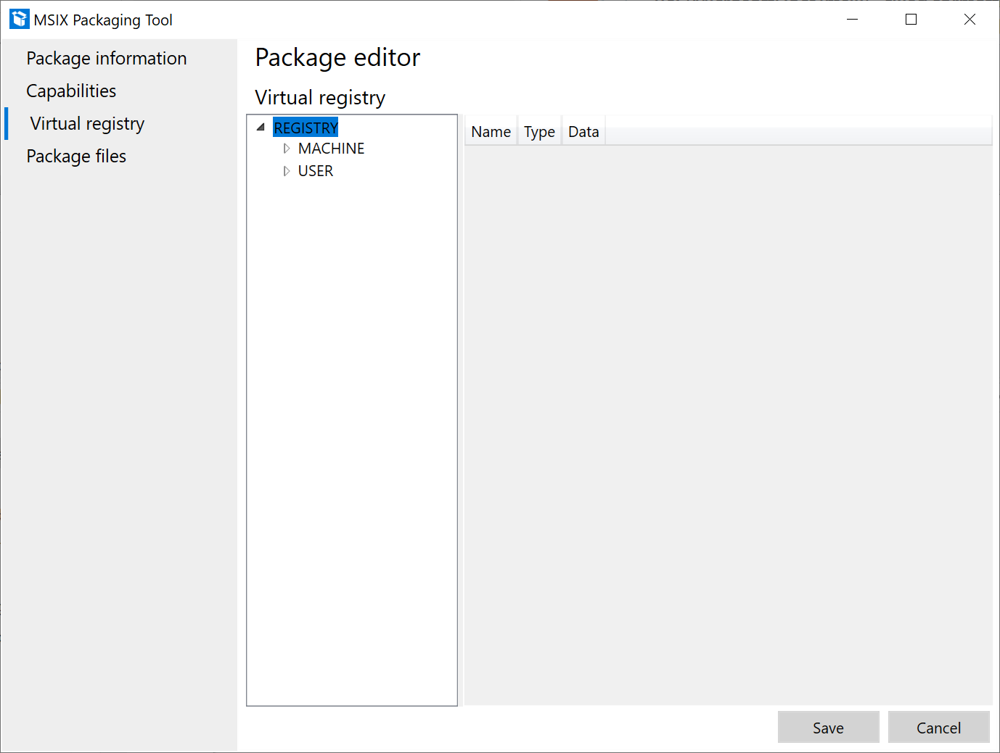
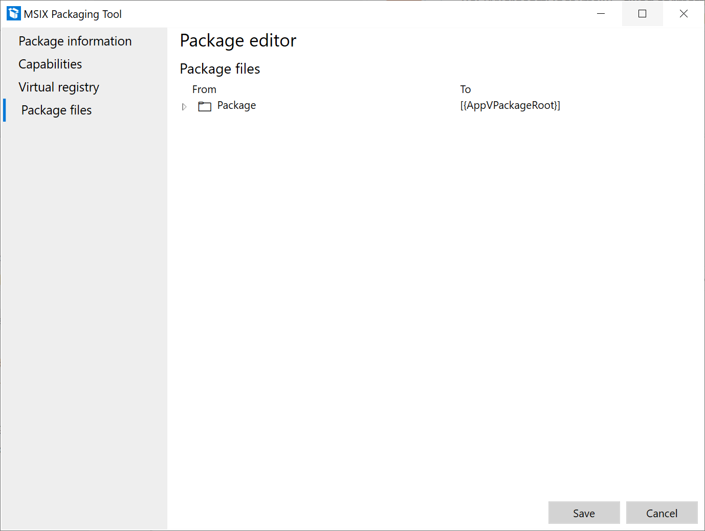

# Package editor

<a class="x-hidden-focus" href="https://www.microsoft.com/en-us/p/msix-packaging-tool/9n5lw3jbcxkf" data-linktype="external">Get MSIX Packaging Tool</a>

      
To make changes to an exiting MSIX package for changing the properties in the manifest or the content of the package without needing to package the installer again, one can use package editor in MSIX Packaging tool. 

From the welcome screen, select the Open package editor tab:

Then they hit browse to locate the MSIX package that needs to be edited and select open package:

Package editor now shows the content and properties of the package.

First page shows the package information, user can change the package info in the UI or choose to open the MSIX manifest file manually in their editor of choice to make changes to the manifest fields. While they are editing the manifest the package editor page is not editable. Once the save the manifest, the UI will get updated.

User can select save button when they are done editing the package or hit cancel or x to discard the changes. Otherwise they can navigate to other pages by clicking on the pages on the left-hand side.

In this page they can add or remove capabilities for the package. If a capability is present in the package, then the checkbox will be checked.
- This translates to the <capability> element in the MSIX manifest.

This page shows all the packaged virtual registry entries for the application. 
There are multiple context menu options on this page:

1. Right click on a node in left window:
    - Expand/collapse: to expand or collapse all the registry keys in the hive
    - Key: allows user to rename, delete or create a new key
    - Value: allows user to add a key value as string, binary or DWORD

2. Right click anywhere in the right window:
 
    - Delete: to delete a key
    - Add String: to add a string value to a key
    - Add binary: to add a binary value to a key
    - Add DWORD: to add a DWORD value to a key

This page shows the package files, user can add or delete files by right clicking on a file and selecting add file or delete.

