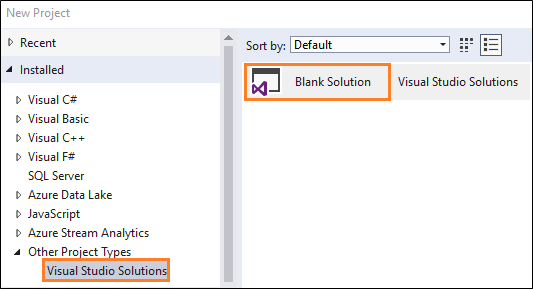
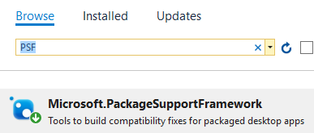
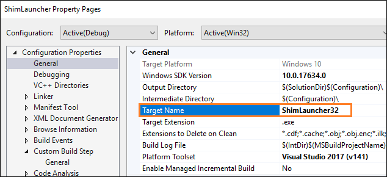
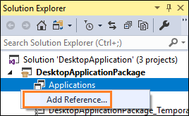

# Apply Package Support Framework in Visual Studios

The [Package Support Framework](package-support-framework-overview.md) is an open source kit that helps you apply fixes to your existing desktop application (without modifying the code) so that it can run in an MSIX container. The Package Support Framework helps your application follow the best practices of the modern runtime environment.

Let's walk through the steps to create and configure each of these projects in your solution.

### Create a package solution

If you don't already have a solution for your desktop application, create a new **Blank Solution** in Visual Studio.



You may also want to add any application projects you have.

### Add a packaging project

If you don't already have a **Windows Application Packaging Project**, create one and add it to your solution.


For more information on Windows Application Packaging project, see [Package your application by using Visual Studio](../desktop/desktop-to-uwp-packaging-dot-net.md).

In **Solution Explorer**, right-click the packaging project, select **Edit**, and then add this to the bottom of the project file:

```xml
<Target Name="PSFRemoveSourceProject" AfterTargets="ExpandProjectReferences" BeforeTargets="_ConvertItems">
<ItemGroup>
  <FilteredNonWapProjProjectOutput Include="@(_FilteredNonWapProjProjectOutput)">
  <SourceProject Condition="'%(_FilteredNonWapProjProjectOutput.SourceProject)'=='<your runtime fix project name goes here>'" />
  </FilteredNonWapProjProjectOutput>
  <_FilteredNonWapProjProjectOutput Remove="@(_FilteredNonWapProjProjectOutput)" />
  <_FilteredNonWapProjProjectOutput Include="@(FilteredNonWapProjProjectOutput)" />
</ItemGroup>
</Target>
```

### Add project for the runtime fix

Add a C++ **Dynamic-Link Library (DLL)** project to the solution.


Right-click the that project, and then choose **Properties**.

In the property pages, find the **C++ Language Standard** field, and then in the drop-down list next to that field, select the **ISO C++17 Standard (/std:c++17)** option.


Right-click that project, and then in the context menu, choose the **Manage Nuget Packages** option. Ensure that the **Package source** option is set to **All** or **nuget.org**.

Click the settings icon next that field.

Search for the *PSF** Nuget package, and then install it for this project.



If you want to debug or extend an existing runtime fix, add the runtime fix files that you obtained by using the guidance described in the [Find a runtime fix](#find) section of this guide.

If you intend to create a brand new fix, don't add anything to this project just yet. We'll help you add the right files to this project later in this guide. For now, we'll continue setting up your solution.

### Add a project that starts the PSF Launcher executable

Add a C++ **Empty Project** project to the solution.


Add the **PSF** Nuget package to this project by using the same guidance described in the previous section.

Open the property pages for the project, and in the **General** settings page, set the **Target Name** property to ``PSFLauncher32`` or ``PSFLauncher64`` depending on the architecture of your application.



Add a project reference to the runtime fix project in your solution.


Right-click the reference, and then in the **Properties** window, apply these values.

| Property | Value |
|-------|-----------|
| Copy local | True |
| Copy Local Satellite Assemblies | True |
| Reference Assembly Output | True |
| Link Library Dependencies | False |
| Link Library Dependency Inputs | False |

### Configure the packaging project

In the packaging project, right-click the **Applications** folder, and then choose **Add Reference**.



Choose the PSF Launcher project and your desktop application project, and then choose the **OK** button.


>[!NOTE]
> If you don't have the source code to your application, just choose the PSF Launcher project. We'll show you how to reference your executable when you create a configuration file.

In the **Applications** node, right-click the PSF Launcher application, and then choose **Set as Entry Point**.


Add a file named ``config.json`` to your packaging project, then, copy and paste the following json text into the file. Set the **Package Action** property to **Content**.

```json
{
    "applications": [
        {
            "id": "",
            "executable": "",
            "workingDirectory": ""
        }
    ],
    "processes": [
        {
            "executable": "",
            "fixups": [
                {
                    "dll": "",
                    "config": {
                    }
                }
            ]
        }
    ]
}
```

Provide a value for each key. Use this table as a guide.

| Array | key | Value |
|-------|-----------|-------|
| applications | id |  Use the value of the `Id` attribute of the `Application` element in the package manifest. |
| applications | executable | The package-relative path to the executable that you want to start. In most cases, you can get this value from your package manifest file before you modify it. It's the value of the `Executable` attribute of the `Application` element. |
| applications | workingDirectory | (Optional) A package-relative path to use as the working directory of the application that starts. If you don't set this value, the operating system uses the `System32` directory as the application's working directory. |
| processes | executable | In most cases, this will be the name of the `executable` configured above with the path and file extension removed. |
| fixups | dll | Package-relative path to the fixup DLL to load. |
| fixups | config | (Optional) Controls how the fixup DLL behaves. The exact format of this value varies on a fixup-by-fixup basis as each fixup can interpret this "blob" as it wants. |

When you're done, your ``config.json`` file will look something like this.

```json
{
  "applications": [
    {
      "id": "DesktopApplication",
      "executable": "DesktopApplication/WinFormsDesktopApplication.exe",
      "workingDirectory": "WinFormsDesktopApplication"
    }
  ],
  "processes": [
    {
      "executable": ".*App.*",
      "fixups": [ { "dll": "RuntimeFix.dll" } ]
    }
  ]
}

```

>[!NOTE]
> The `applications`, `processes`, and `fixups` keys are arrays. That means that you can use the config.json file to specify more than one application, process, and fixup DLL.

### Debug a runtime fix

In Visual Studio, press F5 to start the debugger.  The first thing that starts is the PSF Launcher application, which in turn, starts your target desktop application.  To debug the target desktop application, you'll have to manually attach to the desktop application process by choosing **Debug**->**Attach to Process**, and then selecting the application process. To permit the debugging of a .NET application with a native runtime fix DLL, select managed and native code types (mixed mode debugging).  

Once you've set this up, you can set break points next to lines of code in the desktop application code and the runtime fix project. If you don't have the source code to your application, you'll be able to set break points only next to lines of code in your runtime fix project.

>[!NOTE]
> While Visual Studio gives you the simplest development and debugging experience, there are some limitations, so later in this guide, we'll discuss other debugging techniques that you can apply.

## Create a runtime fix

If there isn't yet a runtime fix for the issue that you want to resolve, you can create a new runtime fix by writing replacement functions and including any configuration data that makes sense. Let's look at each part.

### Replacement functions

First, identify which function calls fail when your application runs in an MSIX container. Then, you can create replacement functions that you'd like the runtime manager to call instead. This gives you an opportunity to replace the implementation of a function with behavior that conforms to the rules of the modern runtime environment.

In Visual Studio, open the runtime fix project that you created earlier in this guide.

Declare the ``FIXUP_DEFINE_EXPORTS`` macro and then add a include statement for the `fixup_framework.h` at the top of each .CPP file where you intend to add the functions of your runtime fix.

```c++
#define FIXUP_DEFINE_EXPORTS
#include <fixup_framework.h>
```

>[!IMPORTANT]
>Make sure that the `FIXUP_DEFINE_EXPORTS` macro appears before the include statement.

Create a function that has the same signature of the function who's behavior you want to modify. Here's an example function that replaces the `MessageBoxW` function.

```c++
auto MessageBoxWImpl = &::MessageBoxW;
int WINAPI MessageBoxWFixup(
    _In_opt_ HWND hwnd,
    _In_opt_ LPCWSTR,
    _In_opt_ LPCWSTR caption,
    _In_ UINT type)
{
    return MessageBoxWImpl(hwnd, L"SUCCESS: This worked", caption, type);
}

DECLARE_FIXUP(MessageBoxWImpl, MessageBoxWFixup);
```

The call to `DECLARE_FIXUP` maps the `MessageBoxW` function to your new replacement function. When your application attempts to call the `MessageBoxW` function, it will call the replacement function instead.

#### Protect against recursive calls to functions in runtime fixes

You can optionally apply the `reentrancy_guard` type to your functions that protect against recursive calls to functions in runtime fixes.

For example, you might produce a replacement function for the `CreateFile` function. Your implementation might call the `CopyFile` function, but the implementation of the `CopyFile` function might call the `CreateFile` function. This may lead to an infinite recursive cycle of calls to the `CreateFile` function.

For more information on `reentrancy_guard` see [authoring.md](https://github.com/Microsoft/MSIX-PackageSupportFramework/blob/master/Authoring.md)

### Configuration data

If you want to add configuration data to your runtime fix, consider adding it to the ``config.json``. That way, you can use the `FixupQueryCurrentDllConfig` to easily parse that data. This example parses a boolean and string value from that configuration file.

```c++
if (auto configRoot = ::FixupQueryCurrentDllConfig())
{
    auto& config = configRoot->as_object();

    if (auto enabledValue = config.try_get("enabled"))
    {
        g_enabled = enabledValue->as_boolean().get();
    }

    if (auto logPathValue = config.try_get("logPath"))
    {
        g_logPath = logPathValue->as_string().wstring();
    }
}
```

### Fixup metadata

Each fixup and the PSF Launcher application has an XML metadata file that contains the following information:

* Version: The version of the PSF is in MAJOR.MINOR.PATCH format according to [Sem Version 2](https://semver.org/).
* Minimum Windows Platform: The minimum windows version required for the fixup or PSF Launcher.
* Description: A short description of the fixup.
* WhenToUse: Heuristics on when you should apply the fixup.

For an example, see the [FileRedirectionFixupMetadata.xml](https://github.com/microsoft/MSIX-PackageSupportFramework/blob/master/fixups/FileRedirectionFixup/FileRedirectionFixupMetadata.xml) metadata file for the redirection fixup. The metadata schema is available [here](https://github.com/microsoft/MSIX-PackageSupportFramework/blob/master/MetadataSchema.xsd).

## Other debugging techniques

While Visual Studio gives you the simplest development and debugging experience, there are some limitations.

First, F5 debugging runs the application by deploying loose files from the package layout folder path, rather than installing from a .msix / .appx package.  The layout folder typically does not have the same security restrictions as an installed package folder. As a result, it may not be possible to reproduce package path access denial errors prior to applying a runtime fix.

To address this issue, use .msix / .appx package deployment rather than F5 loose file deployment.  To create a .msix / .appx package file, use the [MakeAppx](https://docs.microsoft.com/windows/desktop/appxpkg/make-appx-package--makeappx-exe-) utility from the Windows SDK, as described above. Or, from within Visual Studio, right-click your application project node and select **Store**->**Create App Packages**.

Another issue with Visual Studio is that it does not have built-in support for attaching to any child processes launched by the debugger.   This makes it difficult to debug logic in the startup path of the target application, which must be manually attached by Visual Studio after launch.

To address this issue, use a debugger that supports child process attach.  Note that it is generally not possible to attach a just-in-time (JIT) debugger to the target application.  This is because most JIT techniques involve launching the debugger in place of the target app, via the ImageFileExecutionOptions registry key.  This defeats the detouring mechanism used by PSFLauncher.exe to inject FixupRuntime.dll into the target app.  WinDbg, included in the [Debugging Tools for Windows](https://docs.microsoft.com/windows-hardware/drivers/debugger/index), and obtained from the [Windows SDK](https://developer.microsoft.com/windows/downloads/windows-10-sdk), supports child process attach.  It also now supports directly [launching and debugging a UWP app](https://docs.microsoft.com/windows-hardware/drivers/debugger/debugging-a-uwp-app-using-windbg#span-idlaunchinganddebuggingauwpappspanspan-idlaunchinganddebuggingauwpappspanspan-idlaunchinganddebuggingauwpappspanlaunching-and-debugging-a-uwp-app).

To debug target application startup as a child process, start ``WinDbg``.

```powershell
windbg.exe -plmPackage PSFSampleWithFixup_1.0.59.0_x86__7s220nvg1hg3m -plmApp PSFSample
```

At the ``WinDbg`` prompt, enable child debugging and set appropriate breakpoints.

```powershell
.childdbg 1
g
```

(execute until target application starts and breaks into the debugger)

```powershell
sxe ld fixup.dll
g
```

(execute until the fixup DLL is loaded)

```powershell
bp ...
```

>[!NOTE]
> [PLMDebug](https://docs.microsoft.com/windows-hardware/drivers/debugger/plmdebug) can be also used to attach a debugger to an app upon launch, and is also included in the [Debugging Tools for Windows](https://docs.microsoft.com/windows-hardware/drivers/debugger/index).  However, it is more complex to use than the direct support now provided by WinDbg.