# Get Started with Package Support Framework 

The [Package Support Framework](package-support-framework-overview.md) is an open source kit that helps you apply fixes to your existing desktop application (without modifying the code) so that it can run in an MSIX container. The Package Support Framework helps your application follow the best practices of the modern runtime environment.

This article provides an indepth look at each component of Package Support Framework and step by step guide to using it.

## Understand what is inside a Package Support Framework

The Package Support Framework contains an executable, a runtime manager  DLL, and a set of runtime fixes.


Here is the process: 
1. Create a configuration file that specifies the fixes that you want to apply to your application. 
1. Modify your package to point to the Package Support Framework (PSF) launcher executable file.

When users starts your application, the Package Support Framework launcher is the first executable that runs. It reads your configuration file and injects the runtime fixes and the runtime manager DLL into the application process. The runtime manager applies the fix when it's needed by the application to run inside of an MSIX container.


## Step 1: Identify packaged application compatibility issues

First, create a package for your application. Then, install it, run it, and observe its behavior. You might receive error messages that can help you identify a compatibility issue. You can also use [Process Monitor](https://docs.microsoft.com/sysinternals/downloads/procmon) to identify issues.  Common issues relate to application assumptions regarding the working directory and program path permissions.

### Using Process Monitor to identify an issue

[Process Monitor](https://docs.microsoft.com/sysinternals/downloads/procmon) is a powerful utility for observing an app's file and registry operations, and their results.  This can help you to understand application compatibility issues.  After opening Process Monitor, add a filter (Filter > Filter…) to include only events from the application executable.

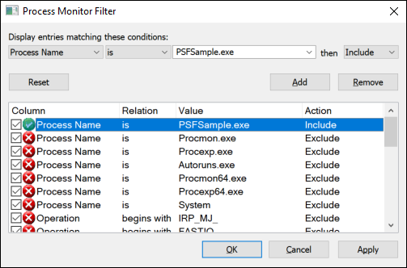

A list of events will appear. For many of these events, the word **SUCCESS** will appear in the **Result** column.

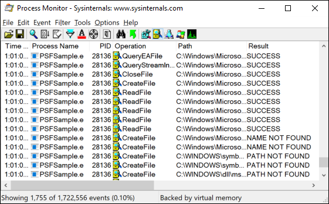

Optionally, you can filter events to only show only failures.

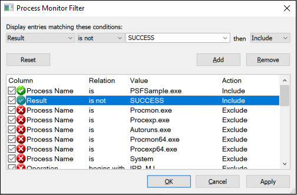

If you suspect a filesystem access failure, search for failed events that are under either the System32/SysWOW64 or the package file path. Filters can also help here, too. Start at the bottom of this list and scroll upwards. Failures that appear at the bottom of this list have occurred most recently. Pay most attention to errors that contain strings such as "access denied," and "path/name not found", and ignore things that don't look suspicious. The [PSFSample](https://github.com/Microsoft/MSIX-PackageSupportFramework/blob/master/samples/PSFSample/) has two issues. You can see those issues in the list that appears in the following image.

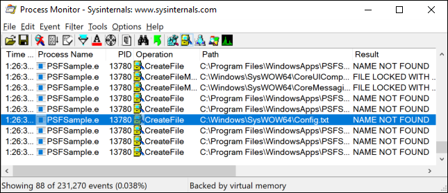

In the first issue that appears in this image, the application is failing to read from the "Config.txt" file that is located in the "C:\Windows\SysWOW64" path. It's unlikely that the application is trying to reference that path directly. Most likely, it's trying to read from that file by using a relative path, and by default, "System32/SysWOW64" is the application's working directory. This suggests that the application is expecting its current working directory to be set to somewhere in the package. Looking inside of the appx, we can see that the file exists in the same directory as the executable.

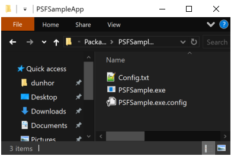

The second issue appears in the following image.


In this issue, the application is failing to write a .log file to its package path. This would suggest that a file redirection fixup might help.

<a id="find"></a>

## Step 2: Find a runtime fix

The PSF contains runtime fixes that you can use right now, such as the file redirection fixup.

### File Redirection Fixup

You can use the [File Redirection Fixup](https://github.com/Microsoft/MSIX-PackageSupportFramework/tree/master/fixups/FileRedirectionFixup) to redirect attempts to write or read data in a directory that isn't accessible from an application that runs in an MSIX container.

For example, if your application writes to a log file that is in the same directory as your applications executable, then you can use the [File Redirection Fixup](https://github.com/Microsoft/MSIX-PackageSupportFramework/tree/master/fixups/FileRedirectionFixup) to create that log file in another location, such as the local app data store.

### Runtime fixes from the community

Make sure to review the community contributions to our [GitHub](https://github.com/Microsoft/MSIX-PackageSupportFramework) page. It's possible that other developers have resolved an issue similar to yours and have shared a runtime fix.

## Step 3: Apply a runtime fix

You can apply an existing runtime fix with a few simple tools from the Windows SDK, and by following these steps.

> [!div class="checklist"]
> * Create a package layout folder
> * Get the Package Support Framework files
> * Add them to your package
> * Modify the package manifest
> * Create a configuration file

Let's go through each task.

### Create the package layout folder

If you have a .msix (or .appx) file already, you can unpack its contents into a layout folder that will serve as the staging area for your package. You can do this from a command prompt using MakeAppx tool, based on your installation path of the SDK, this is where you will find the makeappx.exe tool on your Windows 10 PC:
x86: C:\Program Files (x86)\Windows Kits\10\bin\x86\makeappx.exe
x64: C:\Program Files (x86)\Windows Kits\10\bin\x64\makeappx.exe

```powershell
makeappx unpack /p PSFSamplePackage_1.0.60.0_AnyCPU_Debug.msix /d PackageContents

```

This will give you something that looks like the following.


If you don't have a .msix (or .appx) file to start with, you can create the package folder and files from scratch.

### Get the Package Support Framework files

You can get the PSF Nuget package by using the standalone Nuget command line tool or via Visual Studio.

#### Get the package by using the command line tool

Install the Nuget command line tool from this location: https://www.nuget.org/downloads. Then, from the Nuget command line, run this command: 

```powershell
nuget install Microsoft.PackageSupportFramework
```

Alternatively, you can rename the package extension to .zip and unzip it. All the files you need will be under the /bin folder.

#### Get the package by using Visual Studio

In Visual Studio, right-click your solution or project node and pick one of the Manage Nuget Packages commands.  Search for **Microsoft.PackageSupportFramework** or **PSF** to find the package on Nuget.org. Then, install it.

### Add the Package Support Framework files to your package

Add the required 32-bit and 64-bit PSF DLLs and executable files to the package directory. Use the following table as a guide. You'll also want to include any runtime fixes that you need. In our example, we need the file redirection runtime fix.

| Application executable is x64 | Application executable is x86 |
|-------------------------------|-----------|
| [PSFLauncher64.exe](https://github.com/Microsoft/MSIX-PackageSupportFramework/tree/master/PsfLauncher/readme.md) |  [PSFLauncher32.exe](https://github.com/Microsoft/MSIX-PackageSupportFramework/tree/master/PsfLauncher/readme.md) |
| [PSFRuntime64.dll](https://github.com/Microsoft/MSIX-PackageSupportFramework/tree/master/PsfRuntime/readme.md) | [PSFRuntime32.dll](https://github.com/Microsoft/MSIX-PackageSupportFramework/tree/master/PsfRuntime/readme.md) |
| [PSFRunDll64.exe](https://github.com/Microsoft/MSIX-PackageSupportFramework/blob/master/PsfRunDll/readme.md) | [PSFRunDll32.exe](https://github.com/Microsoft/MSIX-PackageSupportFramework/blob/master/PsfRunDll/readme.md) |

Your package content should now look something like this.

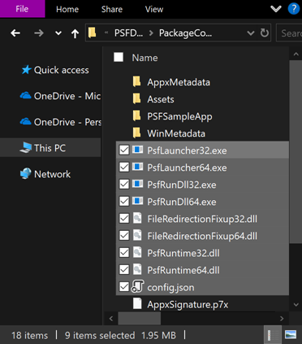

### Modify the package manifest

Open your package manifest in a text editor, and then set the `Executable` attribute of the `Application` element to the name of the PSF Launcher executable file.  If you know the architecture of your target application, select the appropriate version, PSFLauncher32.exe or PSFLauncher64.exe.  If not, PSFLauncher32.exe will work in all cases.  Here's an example.

```xml
<Package ...>
  ...
  <Applications>
    <Application Id="PSFSample"
                 Executable="PSFLauncher32.exe"
                 EntryPoint="Windows.FullTrustApplication">
      ...
    </Application>
  </Applications>
</Package>
```

### Create a configuration file

Create a file name ``config.json``, and save that file to the root folder of your package. Modify the declared app ID of the config.json file to point to the executable that you just replaced. Using the knowledge that you gained from using Process Monitor, you can also set the working directory as well as use the file redirection fixup to redirect reads/writes to .log files under the package-relative "PSFSampleApp" directory.

```json
{
    "applications": [
        {
            "id": "PSFSample",
            "executable": "PSFSampleApp/PSFSample.exe",
            "workingDirectory": "PSFSampleApp/"
        }
    ],
    "processes": [
        {
            "executable": "PSFSample",
            "fixups": [
                {
                    "dll": "FileRedirectionFixup.dll",
                    "config": {
                        "redirectedPaths": {
                            "packageRelative": [
                                {
                                    "base": "PSFSampleApp/",
                                    "patterns": [
                                        ".*\\.log"
                                    ]
                                }
                            ]
                        }
                    }
                }
            ]
        }
    ]
}
```

Following is a guide for the config.json schema:

| Array | key | Value |
|-------|-----------|-------|
| applications | id |  Use the value of the `Id` attribute of the `Application` element in the package manifest. |
| applications | executable | The package-relative path to the executable that you want to start. In most cases, you can get this value from your package manifest file before you modify it. It's the value of the `Executable` attribute of the `Application` element. |
| applications | workingDirectory | (Optional) A package-relative path to use as the working directory of the application that starts. If you don't set this value, the operating system uses the `System32` directory as the application's working directory. |
| processes | executable | In most cases, this will be the name of the `executable` configured above with the path and file extension removed. |
| fixups | dll | Package-relative path to the fixup, .msix/.appx  to load. |
| fixups | config | (Optional) Controls how the fixup dll behaves. The exact format of this value varies on a fixup-by-fixup basis as each fixup can interpret this "blob" as it wants. |

The `applications`, `processes`, and `fixups` keys are arrays. That means that you can use the config.json file to specify more than one application, process, and fixup DLL.

### Package and test the app

Next, create a package.

```powershell
makeappx pack /d PackageContents /p PSFSamplePackageFixup.msix
```

Then, sign it.

```powershell
signtool sign /a /v /fd sha256 /f ExportedSigningCertificate.pfx PSFSamplePackageFixup.msix
```

For more information, see [how to create a package signing certificate](https://docs.microsoft.com/windows/desktop/appxpkg/how-to-create-a-package-signing-certificate)
and [how to sign a package using signtool](https://docs.microsoft.com/windows/desktop/appxpkg/how-to-sign-a-package-using-signtool)

Using PowerShell, install the package.

>[!NOTE]
> Remember to uninstall the package first.

```powershell
powershell Add-AppPackage .\PSFSamplePackageFixup.msix
```

Run the application and observe the behavior with runtime fix applied.  Repeat the diagnostic and packaging steps as necessary.

### Check whether the Package Support Framework is running 

You can check whether your runtime fix is running. A way to do this is to open **Task Manager** and click **More details**. Find the app that the package support framework was applied to and expand the app detail to veiw more details. You should be able to view that the Package Support Framework is running. 

### Use the Trace Fixup

An alternative technique to diagnosing packaged application compatibility issues is to use the Trace Fixup. This DLL is included with the PSF and provides a detailed diagnostic view of the app's behavior, similar to Process Monitor.  It is specially designed to reveal application compatibility issues.  To use the Trace Fixup, add the DLL to the package, add the following fragment to your config.json, and then package and install your application.

```json
{
    "dll": "TraceFixup.dll",
    "config": {
        "traceLevels": {
            "filesystem": "allFailures"
        }
    }
}
```

By default, the Trace Fixup filters out failures that might be considered "expected".  For example, applications might try to unconditionally delete a file without checking to see if it already exists, ignoring the result. This has the unfortunate consequence that some unexpected failures might get filtered out, so in the above example, we opt to receive all failures from filesystem functions. We do this because we know from before that the attempt to read from the Config.txt file fails with the message "file not found". This is a failure that is frequently observed and not generally assumed to be unexpected. In practice it's likely best to start out filtering only to unexpected failures, and then falling back to all failures if there's an issue that still can't be identified.

By default, the output from the Trace Fixup gets sent to the attached debugger. For this example, we aren't going to attach a debugger, and will instead use the [DebugView](https://docs.microsoft.com/sysinternals/downloads/debugview) program from SysInternals to view its output. After running the app, we can see the same failures as before, which would point us towards the same runtime fixes.


## Debug, extend, or create a runtime fix

You can use Visual Studio to debug a runtime fix, extend a runtime fix, or create one from scratch. You'll need to do these things to be successful.

> [!div class="checklist"]
> * Add a packaging project
> * Add project for the runtime fix
> * Add a project that starts the PSF Launcher executable
> * Configure the packaging project

When you're done, your solution will look something like this.

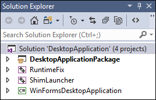

Let's look at each project in this example.

| Project | Purpose |
|-------|-----------|
| DesktopApplicationPackage | This project is based on the [Windows Application Packaging project](../desktop/desktop-to-uwp-packaging-dot-net.md) and it outputs the MSIX package. |
| Runtimefix | This is a C++ Dynamic-Linked Library project that contains one or more replacement functions that serve as the runtime fix. |
| PSFLauncher | This is C++ Empty Project. This project is a place to collect the runtime distributable files of the Package Support Framework. It outputs an executable file. That executable is the first thing that runs when you start the solution. |
| WinFormsDesktopApplication | This project contains the source code of a desktop application. |

To look at a complete sample that contains all of these types of projects, see [PSFSample](https://github.com/Microsoft/MSIX-PackageSupportFramework/blob/master/samples/PSFSample/).

Let's walk through the steps to create and configure each of these projects in your solution.

### Create a package solution

If you don't already have a solution for your desktop application, create a new **Blank Solution** in Visual Studio.


You may also want to add any application projects you have.

### Add a packaging project

If you don't already have a **Windows Application Packaging Project**, create one and add it to your solution.


For more information on Windows Application Packaging project, see [Package your application by using Visual Studio](../desktop/desktop-to-uwp-packaging-dot-net.md).

In **Solution Explorer**, right-click the packaging project, select **Edit**, and then add this to the bottom of the project file:

```xml
<Target Name="PSFRemoveSourceProject" AfterTargets="ExpandProjectReferences" BeforeTargets="_ConvertItems">
<ItemGroup>
  <FilteredNonWapProjProjectOutput Include="@(_FilteredNonWapProjProjectOutput)">
  <SourceProject Condition="'%(_FilteredNonWapProjProjectOutput.SourceProject)'=='<your runtime fix project name goes here>'" />
  </FilteredNonWapProjProjectOutput>
  <_FilteredNonWapProjProjectOutput Remove="@(_FilteredNonWapProjProjectOutput)" />
  <_FilteredNonWapProjProjectOutput Include="@(FilteredNonWapProjProjectOutput)" />
</ItemGroup>
</Target>
```

### Add project for the runtime fix

Add a C++ **Dynamic-Link Library (DLL)** project to the solution.


Right-click the that project, and then choose **Properties**.

In the property pages, find the **C++ Language Standard** field, and then in the drop-down list next to that field, select the **ISO C++17 Standard (/std:c++17)** option.

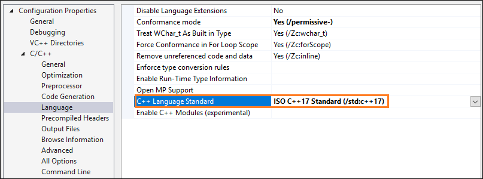

Right-click that project, and then in the context menu, choose the **Manage Nuget Packages** option. Ensure that the **Package source** option is set to **All** or **nuget.org**.

Click the settings icon next that field.

Search for the *PSF** Nuget package, and then install it for this project.


If you want to debug or extend an existing runtime fix, add the runtime fix files that you obtained by using the guidance described in the [Find a runtime fix](#find) section of this guide.

If you intend to create a brand new fix, don't add anything to this project just yet. We'll help you add the right files to this project later in this guide. For now, we'll continue setting up your solution.

### Add a project that starts the PSF Launcher executable

Add a C++ **Empty Project** project to the solution.

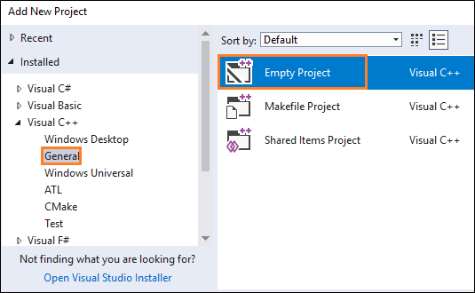

Add the **PSF** Nuget package to this project by using the same guidance described in the previous section.

Open the property pages for the project, and in the **General** settings page, set the **Target Name** property to ``PSFLauncher32`` or ``PSFLauncher64`` depending on the architecture of your application.


Add a project reference to the runtime fix project in your solution.

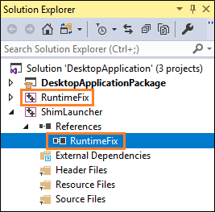

Right-click the reference, and then in the **Properties** window, apply these values.

| Property | Value |
|-------|-----------|
| Copy local | True |
| Copy Local Satellite Assemblies | True |
| Reference Assembly Output | True |
| Link Library Dependencies | False |
| Link Library Dependency Inputs | False |

### Configure the packaging project

In the packaging project, right-click the **Applications** folder, and then choose **Add Reference**.


Choose the PSF Launcher project and your desktop application project, and then choose the **OK** button.


>[!NOTE]
> If you don't have the source code to your application, just choose the PSF Launcher project. We'll show you how to reference your executable when you create a configuration file.

In the **Applications** node, right-click the PSF Launcher application, and then choose **Set as Entry Point**.

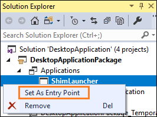

Add a file named ``config.json`` to your packaging project, then, copy and paste the following json text into the file. Set the **Package Action** property to **Content**.

```json
{
    "applications": [
        {
            "id": "",
            "executable": "",
            "workingDirectory": ""
        }
    ],
    "processes": [
        {
            "executable": "",
            "fixups": [
                {
                    "dll": "",
                    "config": {
                    }
                }
            ]
        }
    ]
}
```

Provide a value for each key. Use this table as a guide.

| Array | key | Value |
|-------|-----------|-------|
| applications | id |  Use the value of the `Id` attribute of the `Application` element in the package manifest. |
| applications | executable | The package-relative path to the executable that you want to start. In most cases, you can get this value from your package manifest file before you modify it. It's the value of the `Executable` attribute of the `Application` element. |
| applications | workingDirectory | (Optional) A package-relative path to use as the working directory of the application that starts. If you don't set this value, the operating system uses the `System32` directory as the application's working directory. |
| processes | executable | In most cases, this will be the name of the `executable` configured above with the path and file extension removed. |
| fixups | dll | Package-relative path to the fixup DLL to load. |
| fixups | config | (Optional) Controls how the fixup DLL behaves. The exact format of this value varies on a fixup-by-fixup basis as each fixup can interpret this "blob" as it wants. |

When you're done, your ``config.json`` file will look something like this.

```json
{
  "applications": [
    {
      "id": "DesktopApplication",
      "executable": "DesktopApplication/WinFormsDesktopApplication.exe",
      "workingDirectory": "WinFormsDesktopApplication"
    }
  ],
  "processes": [
    {
      "executable": ".*App.*",
      "fixups": [ { "dll": "RuntimeFix.dll" } ]
    }
  ]
}

```

>[!NOTE]
> The `applications`, `processes`, and `fixups` keys are arrays. That means that you can use the config.json file to specify more than one application, process, and fixup DLL.

### Debug a runtime fix

In Visual Studio, press F5 to start the debugger.  The first thing that starts is the PSF Launcher application, which in turn, starts your target desktop application.  To debug the target desktop application, you'll have to manually attach to the desktop application process by choosing **Debug->Attach to Process**, and then selecting the application process. To permit the debugging of a .NET application with a native runtime fix DLL, select managed and native code types (mixed mode debugging).  

Once you've set this up, you can set break points next to lines of code in the desktop application code and the runtime fix project. If you don't have the source code to your application, you'll be able to set break points only next to lines of code in your runtime fix project.

Because F5 debugging runs the application by deploying loose files from the package layout folder path, rather than installing from a .msix/.appx package, the layout folder typically does not have the same security restrictions as an installed package folder. As a result, it may not be possible to reproduce package path access denial errors prior to applying a runtime fix.

To address this issue, use .msix / .appx package deployment rather than F5 loose file deployment.  To create a .msix / .appx package file, use the [MakeAppx](https://docs.microsoft.com/windows/desktop/appxpkg/make-appx-package--makeappx-exe-) utility from the Windows SDK, as described above. Or, from within Visual Studio, right-click your application project node and select **Store -> Create App Packages**.

Another issue with Visual Studio is that it does not have built-in support for attaching to any child processes launched by the debugger.   This makes it difficult to debug logic in the startup path of the target application, which must be manually attached by Visual Studio after launch.

To address this issue, use a debugger that supports child process attach.  Note that it is generally not possible to attach a just-in-time (JIT) debugger to the target application.  This is because most JIT techniques involve launching the debugger in place of the target app, via the ImageFileExecutionOptions registry key.  This defeats the detouring mechanism used by PSFLauncher.exe to inject FixupRuntime.dll into the target app.  WinDbg, included in the [Debugging Tools for Windows](https://docs.microsoft.com/windows-hardware/drivers/debugger/index), and obtained from the [Windows SDK](https://developer.microsoft.com/windows/downloads/windows-10-sdk), supports child process attach.  It also now supports directly [launching and debugging a UWP app](https://docs.microsoft.com/windows-hardware/drivers/debugger/debugging-a-uwp-app-using-windbg#span-idlaunchinganddebuggingauwpappspanspan-idlaunchinganddebuggingauwpappspanspan-idlaunchinganddebuggingauwpappspanlaunching-and-debugging-a-uwp-app).

To debug target application startup as a child process, start ``WinDbg``.

```powershell
windbg.exe -plmPackage PSFSampleWithFixup_1.0.59.0_x86__7s220nvg1hg3m -plmApp PSFSample
```

At the ``WinDbg`` prompt, enable child debugging and set appropriate breakpoints.

```powershell
.childdbg 1
g
```

(execute until target application starts and breaks into the debugger)

```powershell
sxe ld fixup.dll
g
```

(execute until the fixup DLL is loaded)

```powershell
bp ...
```

>[!NOTE]
> [PLMDebug](https://docs.microsoft.com/windows-hardware/drivers/debugger/plmdebug) can be also used to attach a debugger to an app upon launch, and is also included in the [Debugging Tools for Windows](https://docs.microsoft.com/windows-hardware/drivers/debugger/index).  However, it is more complex to use than the direct support now provided by WinDbg.

## Support

Have questions? Ask us on the [Package Support Framework](https://techcommunity.microsoft.com/t5/Package-Support-Framework/bd-p/Package-Support) conversation space on the MSIX tech community site.
